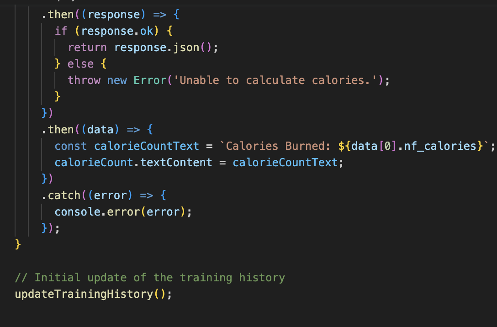

# Node Server

This is a demo application running on a basic node server using the express framework.

# READEME

## Brief introduction of this program

### General explanation

(Prototype)
This website is a tracking software for __individual basketball training__. It records training data, such as shot counts and training programs, and provides encouraging words and feedback to help users develop a daily training plan.

### An introduction to the tools covered by the code
This project mainly uses html and css for front-end web design and presentation, and Java as the back-end development tool. It also uses parcel, node and json as auxiliary tools for server setup and data transfer. All the code is organized and stored on GitHub. __The key point is that this project requests the unplash API for image selection.__

## Development part

### First Step
The developer first designed and built the server. The Java language is used here. And package with a parcel. The advantage of using parcel is that you only download a zip file. There were some errors and coding challenges.

* The first problem that occurs is an unknown error. I was told I needed a string of key characters to exit the error mode, but there was no way I could enter that string of characters, much less exit the error mode.

(Unknown error)

I inquired how other people dealt with this problem on the Internet, and found that there was not an effective way that I could understand or solve this mistake quickly. In order to avoid consuming a lot of time, I had to delete all the code and even rebuild the library on GitHub to solve the problem after many unsuccessful attempts. Fortunately, there was no similar situation in the subsequent process.
.png)(other bug report on github)

* In the subsequent process, when I created the complete code, the server could not be opened for many times, and the following error appeared.

(Unknown error)

The solution to this error is that I have tried to re-type npm run dev many times, but the result is always npm error. Finally, I created a new terminal and retyped npm run dev and this error disappeared. I still don't know where this error came from, or what the effective solution is, but fortunately it didn't appear in the subsequent process.

```
After eliminating two errors, and with the help of tut tutorial code, I finally managed to set up the server.
```
(Final)


### Second Step
After completing the establishment of the server, I chose to develop and design the front end. Start with the html section, which is the basic layout of the web page. The layout of the web page went through two iterations to reach its current version. The most important part of the html section is the use of forms.

#### First iteration
The first change was in the data model. The previous data model was as follows.


This version of the data model was too idealistic to be operational, so I changed it, as shown in the following code.

```HTML
<label for="trainingType">Training Type:</label>
            <select id="trainingType" name="trainingType">
              <option value="threePoint">Three-Point Shot</option>
              <option value="midRange">Mid-Range Shot</option>
              <option value="freeThrow">Free Throw</option>
              <option value="layup">Layup</option>
            </select>
            <label for="totalShots">Total Shots:</label>
            <input type="number" id="totalShots" name="totalShots" required>
            <label for="madeShots">Made Shots:</label>
            <input type="number" id="madeShots" name="madeShots" required>
            <label for="targetTime">Target Training Time (hours):</label>
            <input type="number" id="targetTime" name="targetTime" required>
            <label for="actualTime">Actual Training Time (hours):</label>
            <input type="number" id="actualTime" name="actualTime" required>
            <label for="remarks">Remarks:</label>
            <textarea id="remarks" name="remarks"></textarea>
```

#### Second iteration
After the change of data model, I explored the newly added elements. I added a new icon representing a basketball player through the following statement, hoping that this change can help the website look richer.

```HTML
        <div>
            
        </div>
```

There are three problems in designing html.

* The first problem is that I need to use a lot of images to help me build my website during the html design process. This required the correct image path, but I had no way to select the correct image path in the beginning. After consulting w3school, I distinguish between./ and.. The difference between /. It is then correctly located in the public folder. It's worth noting that I spent a lot of time relocating the image path when I first moved it to the top folder.

(image's path)

* The second question is about my personal design ideas. When designing icon elements, I want to use the design principle of symmetry, so I want to copy the same icon. But when I copied it, the path to the file was unknown, which crashed my html a bit and affected the development of subsequent css, so I had to use the class to distinguish.

(copy and regular)

* The third question has to do with the java part. When I wanted to select images through fetch api, I wanted to create a container for images, so I positioned src "", but the following reminder appeared. In the end I changed the container and just created the following code.

(empty src"")

```HTML
<div id="imageContainer">More About This Activity
          <div id="calorieCount"> Total Calorie: </div>  
          </div>  
          </div>
```


### Third Step

The development of the application then moved into the css section. Unlike the other parts, I didn't make many mistakes in this part, but I learned a lot. Notably, I set the background of the form element to video, which is a new experiment.

* Even though there are not many mistakes, sometimes it is difficult to achieve perfect style design. One of the most impressive is that there are too many overlapping divs in the layout, and some of them don't use class classification. So when I use div{} I don't have complete control over the corresponding element. So I need to improve over and over again. It is because of the absence of div that there is no lower part of the background of the picture. Here is a demonstration of the chaotic layout.

(mess layout)

* I followed some tutorials online while using the video as the background, and the interesting thing is that they put the property on a horizontal line:
(css)
But when I used the same code I found that the features were not shown. After research I split them up and the effect appeared, I was able to fix the problem, but I still couldn't figure out why they couldn't be written on a line.
```CSS
  background-image: url(pexels-king-siberia-2277978.jpg);
  background-repeat: no-repeat;
  background-size: cover;
```

In order to make the software can be used on different devices, I added @media to achieve this function.
```CSS
@media screen and (max-width: 768px) {
  .container {
    padding: 10px;
  }

  h1 {
    font-size: 20px;
  }

  button {
    font-size: 14px;
  }

  input,
  textarea,
  select {
    font-size: 14px;
  }

  .training-form {
    padding: 10px;
  }

  .training-form h2 {
    font-size: 18px;
  }

  .feedback {
    font-size: 16px;
  }

  .training-history h2 {
    font-size: 18px;
  }

  .training-history li {
    font-size: 14px;
  }

  .image-container {
    margin-top: 20px;
  }

  .calorie-count {
    font-size: 16px;
  }
}
```


### Forth Step

I still have a lot of trouble with Java. Including the absence of basic knowledge. These difficulties caused me to spend a lot of time on this part. But by referring to the code design for the country in Week 10, I ended up with this rough web page. As I said the interesting part is the call and access to the api. My initial plan was to use two apis for selecting images and counting calories burned. However, I removed this section in a subsequent revision, considering that calorie counting requires users to enter more data.



#### About Api
* This is a new experiment for me. There were many problems when I tried to log in unplash as my api interface, and even now there is no way to solve them. The first is the uncertainty of the url. Because I don't know what kind of format the url is, and in what form it appears, I can't find it in the website.

* The second is the setting of request. I wasn't sure if I needed to make a request on the website, but I did.

(unsplash website request)

I still have a lot of work to do with the api.


## Remarks
It's an imperfect site, but it's as far as I can go right now. Through this project, I have learned new things in html, css and Java.

Also, GitHub hasn't had a lot of problems.


## Reference List
```
(N.d.). Retrieved from https://www.pexels.com/zh-cn/photo/2277978/ 
Basketball 3D images - free download on Freepik. (2020). Retrieved from https://www.freepik.com/free-photos-vectors/basketball-3d 
Free photo: Full shot man playing basketball. (2022). Retrieved from https://www.freepik.com/free-photo/full-shot-man-playing-basketball_27828073.htm#query=basketball%203d&amp;position=11&amp;from_view=keyword&amp;track=ais 
Kalam. (n.d.). Retrieved from https://fonts.google.com/specimen/Kalam 
Unsplash. (n.d.). Creation starts here. Retrieved from https://unsplash.com/oauth/applications/456000 
```
